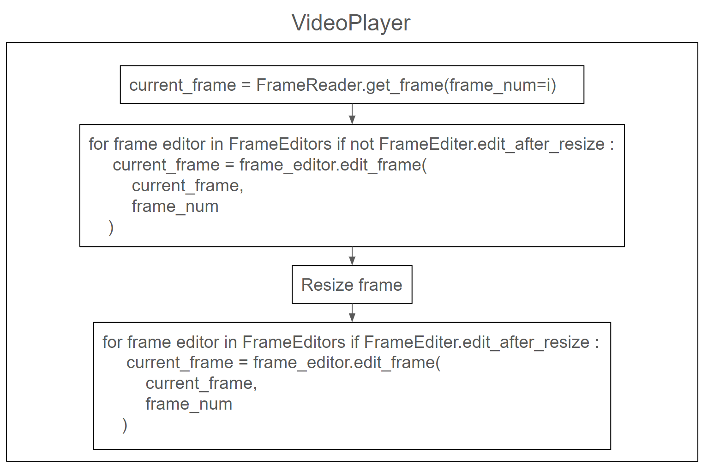

<div align="center"></div>

## Introduction
CV video player is a Python-based customizable video player that helps computer vision practitioners
to develop, analyze, and debug their video-related algorithms and models.


## Installation
`pip install cvvideoplayer`

## Usage
The player is interactive and operates only with keyboard presses (no buttons). The user can register 
shortcuts using the VideoPlayer class's API.

**Design overview**
<div align="center"></div>

The player receives an image from the FrameReader, the frame is then passed to a list of frame editors
which alter it in any way desirable and return the frame. The frame editors also specify whether 
to perform the edit after the frame has been resized to fit the screen or before.

<details>
<summary>FrameReader class</summary>

Implements the following protocol:
```python
class FrameReader(abc.ABC):
    @abc.abstractmethod
    def get_frame(self, frame_num: int) -> Optional[np.ndarray]:
        pass

    @abc.abstractmethod
    def __len__(self) -> int:
        pass
```

A ready-to-use `LocalFrameReader` is already implemented and can be used to read 
any local video file or folder containing the frames as images 
(as long as there is a number in the name of the image files indicating their order).

</details>


<details>
<summary>BaseFrameEditor class</summary>

You can add any number of frame editores for the player to apply using
the VideoPlayer method `add_frame_editor`. A frame editor is an instance of a class
that inherit `BaseFrameEditor` and implements the following abstract methods:

```python
class BaseFrameEditor(ABC):
    @property
    @abstractmethod
    def edit_after_resize(self) -> bool:
        """
        Returns a boolean indicating whether the edit should happen before the frame is resized to fit the frame or
        after. True for after...
        """
        pass

    @abstractmethod
    def _edit_frame(self, frame: np.ndarray, frame_num: int) -> np.ndarray:
        """
        Here is where the editing happens. The function receives a frame and frame number and should return the frame
        after it has been altered in any way desirable by the user

        Args:
            frame (): the input frame
            frame_num ():

        Returns: the edited frame
        """
        pass
```

</details>


<details>
<summary>KeyFunction dataclass</summary>

A `KeyFunction` defines a mapping between a key and a function with an added description of the
function's purpose. You can add a new `KeyFunction` in two ways:
- Using the video player's method `register_key_function`
- Using a FrameEditors property `key_functions_to_register` which returns 
a list of KeyFunctions that will be registered once the FrameEditor is added 
to the player

### default key functions:
These are used by the player and cannot be overwritten:
- "space bar": Play/Pause video
- "right": Next frame
- "left": Previous frame
- "ctrl+right": 10 frames forward
- "ctrl+left": 10 frames back
- "ctrl+shift+right": 50 frames forward
- "ctrl+shift+left": 50 frames back
- "+": Double play speed
- "-": half play speed
- "ctrl++": Increase frame size
- "ctrl+-": Decrease frame size

</details>

<details>
<summary>Recorder class</summary>

The Recorder class can be used to record whatever is being
played in the video player. By default, the video will be saved in an "outputs" folder
which will be automatically created in the CWD.

To use the Recorder:
```python
from cvvideoplayer import VideoPlayer, Recorder
video_player = VideoPlayer(
    recorder=Recorder(),
    **other_video_player_kwargs
)
```

</details>

## Quick Start
```python
from cvvideoplayer import LocalFrameReader, Recorder, VideoPlayer


def run_player():
    video_player = VideoPlayer(
        video_name="example_video",
        frame_reader=LocalFrameReader(source_path="assets/example_video.mp4"),
        recorder=Recorder(),
        add_basic_frame_editors=True,
    )

    with video_player:
        video_player.run()


if __name__ == "__main__":
    run_player()
``` 

In this example, we initiate a very basic video player that will play "example_video.mp4" with added basic
frame editors:
- Frame number printer (disable/enable with **ctrl+f**): Prints the current frame number and original frame resolution in the top left corner
- Histogram Equalizer (disable/enable with **ctrl+h**): Preforms histogram equalization on the image
- Frame Normalizer: Allows the user to print the current frame's intensities histogram and also
set a dynamic range for the image (see printed keymap at runtime for the used keyboard shortcuts).

Check out the `run_video_player.py` which also uses the DetectionsCsvPlotter to plot precalculated detection
